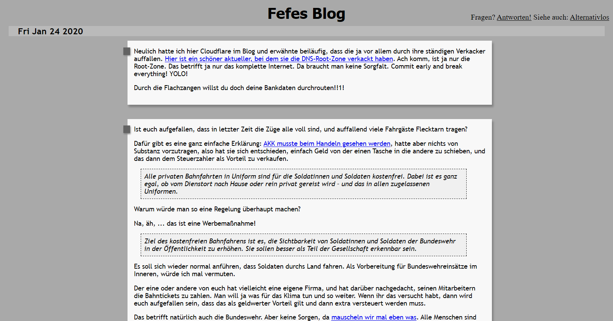

# Beschreibung

Original [fefe.css](https://blog.fefe.de/?ts=b9f2d149) etwas angepasst; Z.B. Seitenbreite begrenzt und frei einstellbar für bessere Lesbarkeit.

# Installation

1. Installiere die [Browsererweiterung Stylus](https://add0n.com/stylus.html) (Direktlinks auf der Seite oben rechts).
2. Klicke hier: 

# Screenshots

