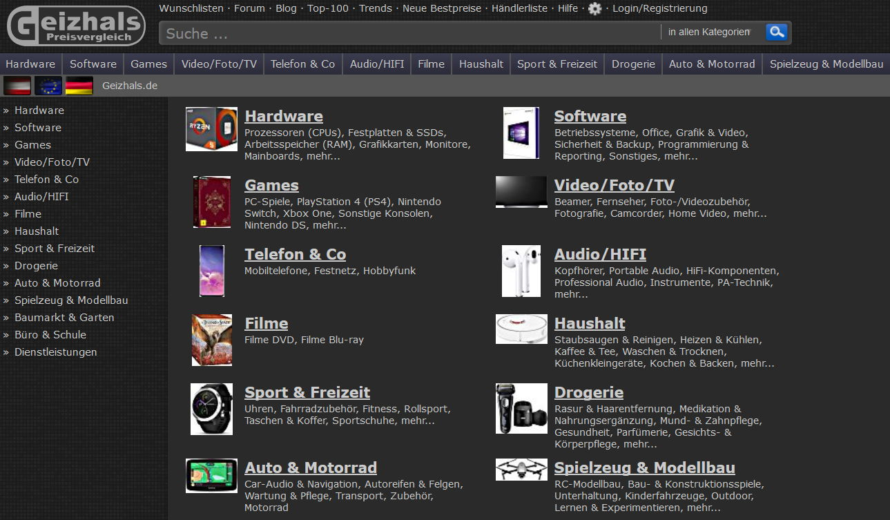
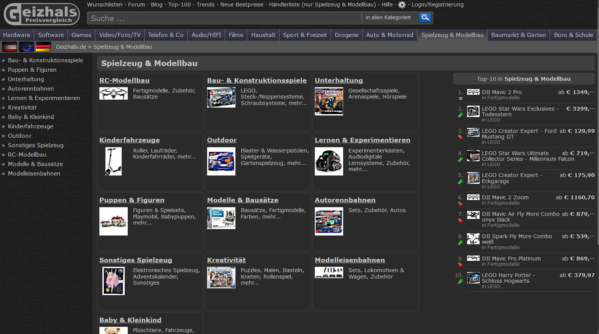
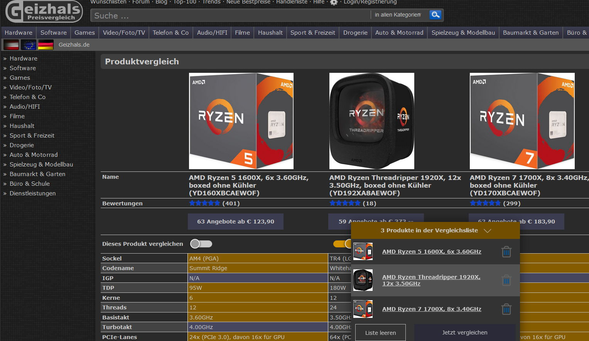

# Beschreibung

Ein UserCSS-Darkstyle für die Geizhals-Preisvergleiche. Optional werden ein paar Kästen entfernt.

Beruht auf dem [Userstyle von evea](https://userstyles.org/styles/134683/).

# Installation

1. Installiere die [Browsererweiterung Stylus](https://add0n.com/stylus.html) (Direktlinks auf der Seite oben rechts).
2. Klicke hier: 

# Screenshots

